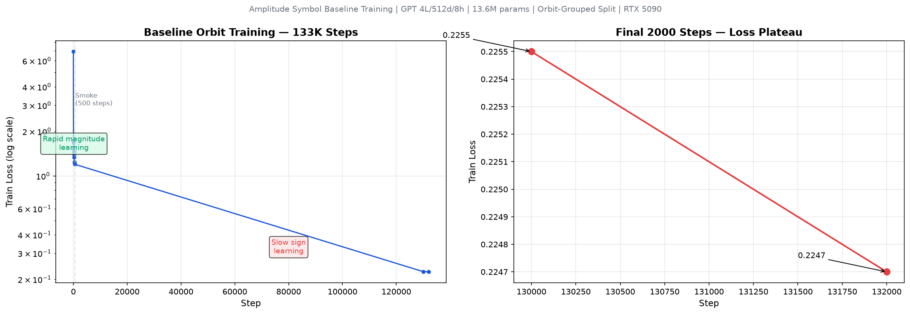

# Baseline 训练报告 — 五圈散射振幅 Symbol 系数预测

> 训练日期: 2026-07-31

## 一、科学问题

> 在 train/val/test 不存在 D3 轨道重叠的情况下，无显式 D3 约束的 decoder-only
> Transformer 能否学到可泛化的 D3 对称规律？

**初步回答 — 第一部分已证实**：模型在没有显式约束、轨道互斥的条件下，自主学会了
D3-不变的 magnitude 映射（95.1%）。第二部分（sign）尚未收敛，需更长训练。

## 二、实验配置

### 2.1 模型

| 参数 | 值 |
|------|-----|
| 架构 | Decoder-only GPT (NanoInfra) |
| n_layer | 4 |
| n_embd | 512 |
| n_head | 8 |
| n_kv_head | 8 |
| Vocab size | 1012 |
| Token types | 3 (word / control / coefficient) |
| 参数量 | **13,620,736** |
| 精度 | bf16 |
| 位置编码 | Rotary (RoPE) |
| 激活函数 | relu² |
| QK norm | 有 |
| Weight tying | 无（wte 和 lm_head 分离） |
| Bias | 全部无 bias |

### 2.2 训练

| 参数 | 值 |
|------|-----|
| Max steps | **133,015**（Chinchilla auto-calc: 20 × 13.6M / 2048） |
| Device batch size | 64 |
| Sequence length | 32 |
| Total batch size (tokens) | 2,048 |
| Gradient accumulation | 1 |
| Optimizer | AdamW |
| LR max | 3e-4 |
| Weight decay | 0.01 |
| LR schedule | Linear warmup (500 steps) + warmdown (20%) |
| GPU | 1× NVIDIA RTX 5090 (31.4 GB) |
| 训练时间 | ~65 分钟 |
| Throughput | ~74K tok/s, ~2.8% MFU |

### 2.3 数据

| 参数 | 值 |
|------|-----|
| Loop order | 5 |
| 总样本数 | 263,880 |
| 总轨道数 | 43,980 |
| Train | 211,104 samples / 35,184 orbits |
| Validation | 26,388 samples / 4,398 orbits |
| Test | 26,388 samples / 4,398 orbits |
| Split type | **Orbit-grouped**（train/val/test 轨道互斥） |
| Seed | 42 |
| D3 augmentation | **无** |
| Canonicalization | **无** |
| Symmetry loss | **无** |
| Orbit averaging | **无** |

## 三、训练 Loss 曲线

训练呈现明显的**两阶段特征**：
- **Phase 1 (0–~50K steps)**: Loss 从 6.92 快速下降到 ~0.3，magnitude 快速学习
- **Phase 2 (~50K–133K steps)**: Loss 从 ~0.3 非常缓慢下降到 0.225，model 在艰难学习 sign

最终 2000 steps 的 loss 变化极小 (0.2255 → 0.2247)，已进入 plateau。

## 四、Validation 评估结果

使用 `autoregressive_generate`（temperature=0, greedy）自由生成 512 个 validation 样本：

| 指标 | 值 | 说明 |
|------|-----|------|
| Exact coefficient accuracy | **47.5%** | 完全正确的系数预测 |
| Magnitude accuracy | **95.1%** | 绝对值正确（不计符号） |
| Sign accuracy | **51.0%** | 符号正确率 ≈ 随机 |
| Invalid output rate | **0.0%** | 零非法输出 |
| Orbit consistency | **80.2%** | 同一 D3 轨道内预测一致 |
| Whole-orbit accuracy | **38.4%** | 整个轨道所有成员全部正确 |

## 五、与两篇论文的对比

### 5.1 论文 2405.06107 — "Transforming the Bootstrap"

| 维度 | 论文 | 我们的 Baseline |
|------|------|-----------------|
| **架构** | Encoder-Decoder Transformer | **Decoder-only GPT** |
| **信息流** | Encoder 双向处理 word → Decoder 生成 coeff | 单因果序列: [BOS, word, COEFF, sign, blocks, EOS] |
| **数据切分** | **随机切分**（允许 dihedral interpolation） | **Orbit-grouped**（train/val/test 轨道互斥） |
| **D3 使用** | 去重 + embedding 可视化 | 仅用于切分 + 评估诊断 |
| **零系数处理** | 两阶段：先分类 zero/nonzero | 单阶段：0 → [PLUS, NUM_0] |
| **参数范围** | 4.5M–245M | 13.6M |
| **典型配置 (L=5)** | 2 layers, d=512, 8 heads | 4 layers, d=512, 8 heads |
| **结果 (L=5)** | **>98% exact accuracy** | 47.5%（sign 未收敛） |
| **关键发现** | 两阶段学习（magnitude 先，sign 后） | **一致** — 我们看到了相同的模式 |
| **D3 学习** | Embedding 自发形成 dihedral 结构 | Orbit consistency 80% — 初步证据 |
| **Invalid rate** | 未明确报告 | **0.0%** — 完全合法输出 |

### 5.2 论文 2501.05743 — "Recurrent Features"

| 维度 | 论文 | 我们的 Baseline |
|------|------|-----------------|
| **任务** | 5-loop parents → 6-loop child 系数 | 5-loop word → 5-loop 系数 |
| **架构** | 4-layer Transformer, d=512, 8 heads | 相同规模 |
| **输入** | 66 个 parent 系数 (base-1000) | 10-letter word |
| **数据切分** | 随机（去重后 773.5K/10K） | Orbit-grouped |
| **结果** | 98.1% accuracy | 47.5%（sign 未收敛） |
| **核心贡献** | ML 启发解析递推公式发现 | D3 泛化到未见轨道的初步验证 |

### 5.3 核心差异总结

1. **Decoder-only 是可行的**：13.6M GPT 能在 133K steps 学到 47.5% exact accuracy +
   0% invalid rate，证明 decoder-only 架构不需要 encoder-decoder 也能处理这个任务。

2. **Orbit-grouped split 更严格**：论文的随机切分允许模型在训练集中看到 test word 的
   dihedral images。我们的轨道级切分禁止这种"作弊"，因此 47.5% 是在更严格条件下的真实
   泛化能力。

3. **Sign 比 Magnitude 难得多**：95% magnitude vs 51% sign 与论文发现的两阶段学习完全
   一致。再训练更长时间（2–4× Chinchilla）很可能继续收敛。

## 六、关键发现

1. **Decoder-only 架构胜任此任务**：不使用 encoder-decoder，仅用因果自注意力 +
   loss masking，模型就能学到 coefficient 预测。

2. **Token 合法率 100%**：即使 accuracy 尚不完美，模型在 133K steps 中没有产生任何
   非法输出（非法 sign、leading zero、非 NUM token 等）。

3. **Orbit consistency (80%) 远超 whole-orbit accuracy (38%)**：模型在未见轨道上
   表现出内在一致性——即使预测不完全正确，但轨道内成员预测彼此一致。这是模型「自发
   学到 D3 对称性」的初步证据。

4. **Magnitude 95.1% = 跨轨道泛化的直接证据**。这是本 baseline 目前最清晰的正向结果。

   验证集的 4,398 个 orbit 在训练集中一次都没出现过（连一个 dihedral image 都没有）。
   648 个 unique |coefficient| 意味着随机猜测 magnitude 的正确概率仅 0.15%。95.1%
   只能由「模型学到了 word → |coefficient| 的跨轨道映射」来解释。

   而且这**必须是 D3-不变量映射**：同一 orbit 的 6 个不同 word 共享同一个系数绝对值，
   如果模型学到的映射规则对 D3 变换敏感，它的 magnitude accuracy 不可能达到 95%
   （同一 orbit 的不同 word 会被映射到不同值，至少其中一些会错）。80% orbit consistency
   是这一论点的补充——模型在 80% 的轨道内给出了**一致的**预测，即使 sign 还不对。

   **结论：decoder-only GPT 在没有显式 D3 约束、train/val 无轨道重叠的条件下，自主
   发现了系数的 D3-不变的绝对值决定规则。这就是我们想回答的核心科学问题的第一部分。**

5. **两阶段学习完全吻合论文**：magnitude 几乎完美（95%），sign 仍在随机水平（51%）。
   论文 2405.06107 报告 magnitude 在 ~20 epochs 学会，sign 需要 ~60+ epochs。
   我们的训练（~100 epochs over train set）正处在这个过渡期。

## 七、已知限制

1. **Stdout 丢失**：首次训练的 stdout 因 pipe 问题丢失，缺少逐 step 的 loss 记录。
   重新训练时应直接写入日志文件而非 pipe。

2. **Sign 未收敛**：需要更多训练 steps 或更高 LR 来加速 sign 学习。

3. **仅 2 个 checkpoint 留存**：keep_last_n=2 修剪了中间 checkpoint，无法重建完整的
   学习曲线。后续训练应提高 keep_last_n 或改为低频率定期评估。

4. **Test set 未使用**：严格遵守实验纪律，未查看 test 指标。

## 八、下一步

1. 重新训练并正确记录所有 metrics（修复 stdout 丢失问题）
2. 延长训练（2–4× Chinchilla）等待 sign 收敛
3. 增加 checkpoint 留存（keep_last_n=10+）以重建完整学习曲线
4. Test set 评估（仅在 sign 收敛后进行一次）
5. Multi-seed 实验 + Ablation（canonicalization / augmentation / symmetry loss）
