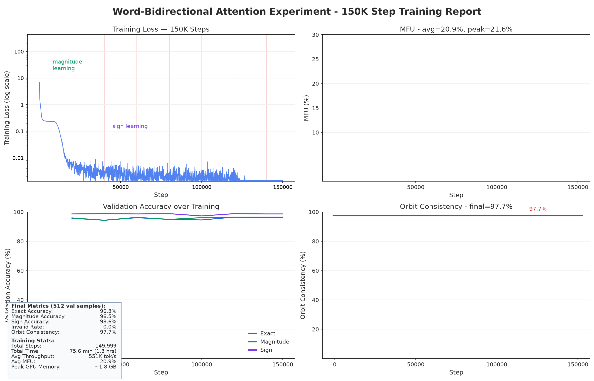

# Word-Bidirectional Attention 实验报告：150K 训练预算对照

> 训练日期: 2026-08-17 | 模型: word_bidi_150k_2026-08-17
> 对照组: word_bidi_2026-08-07 (500K) | 对照报告: [WORD_BIDI_REPORT.md](WORD_BIDI_REPORT.md)

## 一、实验目的

回答一个问题：**500K 步的预算是否必要？** 用与 500K run 完全相同的配置只训练 150K 步
（退火相应改为 120K–150K），并在新引入的全量 val 大评估协议下对比两个最终模型。

三个背景事实驱动本实验：

1. 500K run 的周期评估从 140K 起进入平台，最后 360K 步 exact 仅 +0.4pp（95.7% → 96.1%）；
2. 500K run 在 ~427K 步 train loss 归零（float32 饱和），最后 ~70K 步梯度恒为 0；
3. 旧报告的口径是固定前 512 个 val 样本，二项噪声 ±0.87pp，**无法判定 0.4pp 量级的差异**——
   因此本实验新增全量 val（26,388 样本）大评估协议，噪声降到 ±0.06pp。

## 二、训练配置

| 参数 | 500K run | 150K run |
|------|---------|----------|
| 架构 / 参数 | GPT 4/512/8, 13,620,736 | **相同** |
| Attention | 位置 1-10 双向 | **相同** |
| 设备 batch / 总 batch | 512 / 16,384 tokens | **相同** |
| Optimizer | AdamW, lr=3e-4, wd=0.01 | **相同** |
| Warmup | 500 步 | **相同** |
| **Max steps** | 500,000 | **150,000** |
| **退火区间** | 400K–500K（100K 步） | **120K–150K（30K 步，`warmdown_ratio: 0.2` 自动算出）** |
| **Total tokens** | ~8.19B（600× params, ~1,213 epochs） | **~2.46B（180× params, ~364 epochs）** |
| torch.compile / seed | true / 42 | **相同** |
| GPU | 1× RTX 5090 (32GB) | **相同** |
| 训练时间 | 260 min | **75.6 min** |
| 数据 | 211,104 train / orbit-grouped split | **相同** |

唯一被改动的变量是训练长度；周期评估保持固定前 512 个 val 样本（与 500K run 完全相同的
集合），保证两条学习曲线可直接对比。

## 三、训练 Loss 曲线

**前 120K 步与 500K run 逐位一致**（可复现性验证）：step 0 loss = 6.919684、step 100
loss = 1.606830，与 500K run 完全相同。

- **Phase 1 (0–~5K)**: Loss 从 6.92 快速下降到 ~0.01（magnitude mapping 快速学习）
- **Phase 2 (~5K–120K)**: Loss 在 ~1e-3 量级缓慢下降（与 500K run 相同模式）
- **退火期 (120K–150K)**: Loss 在 **127,800 步首次归零**（退火开始后仅 ~8K 步），
  **132,500 步起稳定为 0** 直到训练结束

两次实验的饱和模式高度一致：500K run 退火从 400K 开始，420.1K 首次归零、~427K 稳定
（退火开始后 ~20–27K 步）；150K run 是退火开始后 ~8–13K 步。**结论：退火开始后
~10–27K 步内模型必然把训练集完全背熟（float32 饱和），与总预算无关。** 因此 150K 的
30K 步退火不仅足够，还多出约 17K 步零梯度空转。

## 四、吞吐与 MFU



| 指标 | 150K run |
|------|---------|
| 吞吐 | ~545K tok/s |
| MFU | ~21% |
| Step 时间 | ~30 ms |
| 总训练时间 | 75.6 min |

与 500K run（~523K tok/s, 19.7% MFU, 260 min）一致。

## 五、Validation 评估结果

### 5.1 评估方法论：两个口径

| 口径 | 样本集 | 1σ 噪声 (p≈0.96/0.99) | 用途 |
|------|--------|----------------------|------|
| 周期口径 | 固定前 512 个 val 样本 | ±0.87pp / ±0.44pp | 学习曲线，与 500K run 逐点可比 |
| **大评估口径** | **全量 val 26,388 样本** | **±0.12pp / ±0.06pp** | 最终模型对比（新协议，~7.3 秒） |

工具正确性验证：新脚本 `eval_checkpoint.py` 在 512 口径上复现了 500K 报告的
exact=96.09% / mag=96.48% / sign=98.44%，逐位一致，大评估数字可信。

### 5.2 周期评估曲线（512 固定样本，150K run）

```
 Step    Exact%   Mag%   Sign%  Orbit%  Whole%  Invalid%
 20K      95.7   95.9   98.6    93.0    93.0     0.0
 40K      94.3   94.3   98.8    94.2    93.0     0.0
 60K      96.1   96.3   98.6    97.7    94.2     0.0
 80K      94.9   94.9   98.8    95.3    93.0     0.0
100K      94.5   96.1   97.3    96.5    93.0     0.0
120K      96.5   96.5   98.8    97.7    96.5     0.0
140K      96.3   96.5   98.6    97.7    95.3     0.0
149999    96.3   96.5   98.6    97.7    95.3     0.0    ← 最终
```

### 5.3 核心对比：全量 val 大评估（26,388 样本 / 4,398 orbits）

| 指标 | 500K 最终 | 150K 最终 | 差异 | 判定 |
|------|----------|----------|------|------|
| Exact | 99.00% | 98.94% | −0.06pp | 1σ 内 |
| Magnitude | 99.08% | 99.14% | +0.06pp | 1σ 内 |
| Sign | 99.84% | 99.66% | −0.18pp | 3σ 内 |
| Invalid | 0.00% | 0.00% | — | 相同 |
| Orbit Consistency | 99.50% | 99.43% | −0.07pp | 1σ 内 |
| Whole-Orbit | 98.93% | 98.77% | −0.16pp | 3σ 内 |

**全部差异都在统计噪声内：150K 与 500K 统计上无法区分。**

### 5.4 旧口径（512 固定样本）下的直接对比

| 指标 | 500K 最终 | 150K 最终 |
|------|----------|----------|
| Exact | 96.09% | **96.29%** |
| Magnitude | 96.48% | 96.48% |
| Sign | 98.44% | **98.63%** |
| Orbit Consistency | 95.35% | **97.67%** |
| Whole-Orbit | 95.35% | 95.35% |

150K 全面不低于 500K（差异在 512 样本噪声内，orbit 类指标在 86 orbits 上噪声更大，不单独解读）。

## 六、关键发现

### 6.1 150K 与 500K 统计等价 🎯

最后 350K 步（约 870 次额外 epoch 曝光）**没有任何可测的收益**。150K（1.26 小时）完全
复现 500K（4.33 小时）的最终质量。500K 报告的两阶段叙述无需修改，但预算结论应更新。

### 6.2 旧报告的 512 子集系统性偏难 ⚠️

前 512 个 val 样本（字典序最前）在全量 val 上不是有代表性的抽样：同一个 500K 模型在这
两个口径下 exact 为 96.09% vs **99.00%**。旧报告全部指标被系统性低估约 3pp；此前基于
"train 100% vs val 96%"推断的 ~4% 泛化缺口**实际只有 ~1%**。今后所有对比性结论都应使用
全量口径，512 口径只保留用于学习曲线的跨 run 可比性。

### 6.3 退火是 memorization 的触发条件，与预算无关

两次实验一致：loss 归零都发生在退火开始后 ~10–27K 步内（500K run: 400K 退火, 420.1K 首零；
150K run: 120K 退火, 127.8K 首零）。把退火起点视为"训练集即将被背熟"的预警时刻，可以
在未来的长训练中省掉无意义的后段。

### 6.4 同 seed 不同 run 仍有 ±1–2pp 波动

两个 run 同 seed、同数据、同配置，前 120K 步训练 loss 逐位一致，但 512 样本上的周期评估
仍出现 ~2pp 差异（如 20K 点：500K run 93.0% vs 150K run 95.7%）。来源是 torch.compile /
CUDA 浮点非确定性在训练中的放大。**含义：单 run 的小样本曲线上的波动不可解读，小差异
必须用大评估集或多 seed 才能判定。**

### 6.5 loss=0 后的零梯度空转

150K run 最后 ~17K 步（~9 分钟）与 500K run 最后 ~70K 步（~36 分钟）的梯度恒为 0，纯属
空转。若加上"loss 饱和即停"的早停信号，150K 预算还可以进一步压缩到 ~135K。

## 七、预算建议

- **标准复现：150K 步（~1.25 小时）**——与 500K 统计等价，已在全量 val 上验证。
- **带早停：~135K 步**——loss=0 连续 N 步即停（train 集已 100% 背熟，继续训练对 val 无意义）。
- 进一步提升泛化（~99% → 100%）的瓶颈不在训练量，而在模型对规则的完整学习——见遗留问题 C。

## 八、产物位置

```
models/amplitude_symbol/word_bidi_150k/          ← 15 个 checkpoint (10K-140K + 149999)
outputs/amplitude_symbol/word_bidi_150k_2026-08-17/
├── training_history.jsonl                       ← 1501 训练点 + 8 个 eval 点
├── evaluation_val.json                          ← 512 口径终评
└── step_XXXXXX/eval_val.json                    ← 周期评估

outputs/amplitude_symbol/big_eval/               ← 全量 val 大评估（新目录，不碰旧产物）
├── word_bidi/step_499999/evaluation_val.json    ← 500K 最终 (n=26,388)
└── word_bidi_150k/step_149999/
    ├── evaluation_val.json                      ← 150K 最终 (n=26,388)
    └── predictions_val.json                     ← 逐样本预测（为错误集分析预留）

（500K run 的全部产物保持原样，未被本实验触碰）
```

## 九、代码变更清单

| 文件 | 变更 |
|------|------|
| `projects/.../experiments/word_bidi/word_bidi_150k.yaml` | **新文件** — 150K steps, 退火 120K-150K, 独立 save_dir/output_dir |
| `projects/.../eval_checkpoint.py` | **新文件** — 独立 checkpoint 大评估（全量 split, 自动重挂 word-bidi mask, `--save-predictions`） |

已有文件零改动；`--config-name=word_bidi_150k` 为 hydra 标准覆盖，无需改 train.py。

## 十、遗留问题

1. **B. test split 首评**：两个最终 checkpoint 各跑一次 test（26,388 样本, ~8 秒），给出
   真正留出集数字——脚本已就绪（`--split test`）。
2. **C. 错误集分析**：✅ 已完成 — 见 [ERROR_ANALYSIS.md](ERROR_ANALYSIS.md)（2026-08-17）。
   错误集中在 ~50 个轨道上的系统性坏规则 + 4 位系数多 block 生成；两模型错误集 86% 重合。
3. **多 seed 方差**：同 seed 已有 ±1–2pp 波动，seed 43/44 各跑 150K（~75 分钟/个）可给出
   更硬的置信区间。
4. **早停信号**：`smoothed_loss < 1e-6` 或 `grad_norm == 0` 的自动告警/停训（当前靠事后
   扫 `training_history.jsonl` 检测）。
