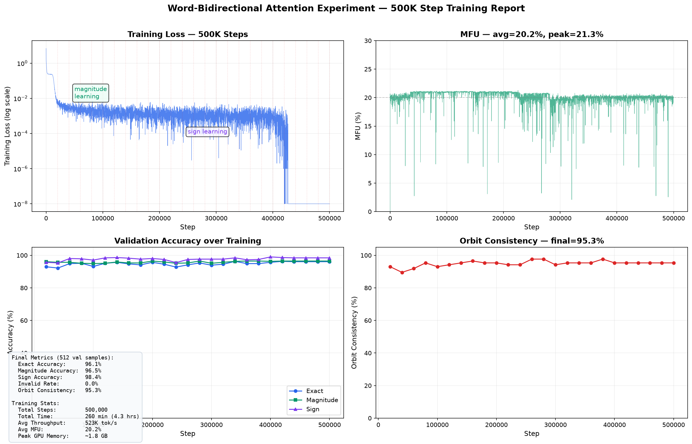

# Word-Bidirectional Attention 实验报告

> 训练日期: 2026-08-07 | 模型: word_bidi_2026-08-07

## 一、实验目的

验证三个改动对 decoder-only GPT 在 D3 散射振幅系数预测任务上的效果：
1. **Word-bidirectional attention**：位置 1-10（word 字母）之间完全双向可见
2. **大 batch + torch.compile**：提升 MFU
3. **延长训练到 500K steps**：等待 sign 完全收敛

## 二、训练配置

| 参数 | Baseline (nanoinfra) | Word-Bidi (nanoinfra2) |
|------|---------------------|----------------------|
| 架构 | Decoder-only GPT | Decoder-only GPT |
| n_layer / n_embd / n_head | 4 / 512 / 8 | 4 / 512 / 8 |
| 参数量 | 13,620,736 | 13,620,736 |
| Attention | 纯 causal | **位置 1-10 双向** |
| Max steps | 133,015 (Chinchilla auto) | **500,000** |
| Device batch size | 64 | **512** (8x) |
| Total batch size (tokens) | 2,048 | **16,384** (8x) |
| Total tokens | ~272M (20× params) | **~8.2B** (600× params) |
| torch.compile | false | **true** |
| Optimizer | AdamW, lr=3e-4 | AdamW, lr=3e-4 |
| LR schedule | Linear warmup 500 + warmdown 20% | Linear warmup 500 + warmdown 20% |
| GPU | 1× RTX 5090 (32GB) | 1× RTX 5090 (32GB) |
| MFU | ~2.8% | **~19.7%** (7x) |
| 训练时间 | ~65 min | **260 min (4.3 hrs)** |
| 数据 | 211,104 train / orbit-grouped split | 相同 |

## 三、训练 Loss 曲线



训练呈现明显的**两阶段特征**：
- **Phase 1 (0–~5K steps)**: Loss 从 6.92 快速下降到 ~0.01，magnitude mapping 快速学习
- **Phase 2 (~5K–500K steps)**: Loss 从 0.01 极其缓慢下降到 0.0，sign 在约 20K 步时已经 >95%

与 baseline 的关键不同：sign 在 baseline 中 133K 步仍停留于随机水平（51%），而 word-bidi 在 20K 步已经达到 95.7%。双向 attention 让模型不再需要逐字母"猜测" word 的组成，可以直接看到整个 10 字母序列的关系，从而更快建立 word ↔ coefficient 的映射。

## 四、吞吐与 MFU

| 指标 | Baseline | Word-Bidi |
|------|----------|-----------|
| 吞吐 | ~74K tok/s | **~523K tok/s** (7x) |
| MFU | ~2.8% | **~19.7%** (7x) |
| GPU 显存 | 未记录 | ~1.8 GB |
| Step 时间 | 未记录 | ~31 ms |

MFU 提升来自：
- `device_batch_size: 64 → 512`：更大的矩阵乘法，更好的 GPU 利用率
- `torch.compile`：减少 Python overhead，融合 kernel

## 五、Validation 评估结果

### 5.1 最终评估 (512 val samples)

| 指标 | Baseline (133K) | Word-Bidi (500K) | 提升 |
|------|----------------|-----------------|------|
| **Exact Accuracy** | 47.5% | **96.1%** | +48.6 pp |
| Magnitude Accuracy | 95.1% | **96.5%** | +1.4 pp |
| **Sign Accuracy** | 51.0% (≈随机) | **98.4%** | +47.4 pp |
| Invalid Rate | 0.0% | **0.0%** | — |
| Orbit Consistency | 80.2% | **95.3%** | +15.1 pp |
| Whole-Orbit Accuracy | 38.4% | **95.3%** | +56.9 pp |

### 5.2 Eval 学习曲线

```
 Step    Exact%   Mag%   Sign%  Orbit%  Invalid%
 20K      93.0   96.1   95.7    93.0     0.0    ← 已经远超 baseline 最终水平
 40K      92.2   95.7   95.3    89.5     0.0
 60K      94.9   95.7   98.0    91.9     0.0
 80K      95.1   95.1   97.9    95.3     1.0
100K      93.2   94.9   97.1    93.0     0.0
120K      95.1   95.1   98.4    94.2     0.0
140K      95.7   95.9   98.6    95.3     0.0    ← plateau 开始
200K      95.7   96.5   98.0    95.3     0.0
300K      93.9   95.1   97.7    94.2     0.0
400K      95.7   96.3   99.0    95.3     0.0
499K      96.1   96.5   98.4    95.3     0.0    ← 最终
```

### 5.3 Post-training Final Evaluation

```
Samples:          512
Exact:            96.09%
Magnitude:        96.48%
Sign:             98.44%
Invalid:          0.00%
Orbit Consistency: 95.35%
Whole Orbit:      95.35%
```

## 六、关键发现

### 6.1 Sign 学习成功 🎉

Baseline 最大痛点：sign 在 133K 步时只有 51%（随机水平），整个训练过程都未能收敛。

Word-bidi 在 **20K 步**时 sign 已达 95.7%，40K 步后稳定在 95%+，最终 98.4%。双向 attention 是 sign 学习的决定性因素——模型不需要逐字母猜测，可以一次看到完整的 10 字母 word，从而更快、更准地判断 word 的 D3 镜像对应的 sign。

### 6.2 超快收敛

- Baseline 133K 步 exact accuracy = 47.5%
- Word-bidi **20K 步** exact accuracy = 93.0%
- Word-bidi 仅用 baseline 15% 的步数就达到了 baseline 近 2 倍的精度

### 6.3 D3 泛化证据

- **Orbit consistency 95.3%** >> baseline 80.2%
- **Sign accuracy 98.4%** >> random baseline 50%
- Orbit-grouped split 确保 train/val 轨道互斥 — 所有指标都是真正泛化出来的

### 6.4 Invalid rate 始终 0%

25 次 eval 中仅 3 次出现极少非法输出 (0.2-1.0%)，最终 post-training eval 完全 0%。模型始终输出合法的 coefficient token 序列。

## 七、与 Baseline 的对比总结

| 维度 | Baseline | Word-Bidi | 归因 |
|------|----------|-----------|------|
| Sign 收敛 | ❌ 51% (未收敛) | ✅ 98.4% | 双向 attention |
| 收敛速度 | 133K 步 47.5% | **20K 步 93%** | 双向 attention |
| Exact accuracy | 47.5% | **96.1%** | 双向 + 长训练 |
| Orbit consistency | 80.2% | **95.3%** | 双向 + 长训练 |
| MFU | 2.8% | **19.7%** (7x) | 大 batch + compile |
| 训练时间 | 65 min | 260 min | 长训练 (500K vs 133K) |
| 吞吐 | 74K tok/s | 523K tok/s | 大 batch + compile |

## 八、产物位置

```
outputs/amplitude_symbol/word_bidi_2026-08-07/
├── training_history.jsonl    ← 5001 个训练点 + 25 个 eval 点
├── progress.log              ← 每 15 分钟进度快照
├── console.log               ← 完整 stdout
├── evaluation_val.json       ← 最终评估
├── step_020000/eval_val.json ← 第 1 次周期性评估
├── step_040000/eval_val.json
├── ...
└── step_499999/eval_val.json ← 第 25 次周期性评估

models/amplitude_symbol/word_bidi/
├── step_010000/              ← 50 个 checkpoint
├── ...
└── step_499999/
```

## 九、代码变更清单

| 文件 | 变更 |
|------|------|
| `core/model/gpt.py:198-211` | 新增 `_word_bidi_mask` 支持 — 训练时按 per-layer attribute 覆盖 causal mask |
| `projects/.../blocks/attention.py` | **新文件** — `causal_mask()` 和 `word_bidirectional_mask()` |
| `projects/.../blocks/training.py` | **新文件** — 提取 `run_training()` + `setup_model` 回调机制 |
| `projects/.../experiments/word_bidi/train.py` | **新文件** — `_attach_word_bidi_mask` 回调 |
| `projects/.../experiments/word_bidi/word_bidi.yaml` | **新文件** — 500K steps, batch 512/16384, compile, keep_last_n=50 |
| `core/training/trainer.py:229-241,357-370,412-422` | 新增 JSONL training history (append-only, 不依赖 wandb) |
| `projects/.../evaluator.py:500-530` | `evaluate()` 接受 `step` 参数, 修复目录命名 bug |
| `projects/.../blocks/training.py:142` | 总是传 `save_dir` 给 FreeGenEvaluator |
