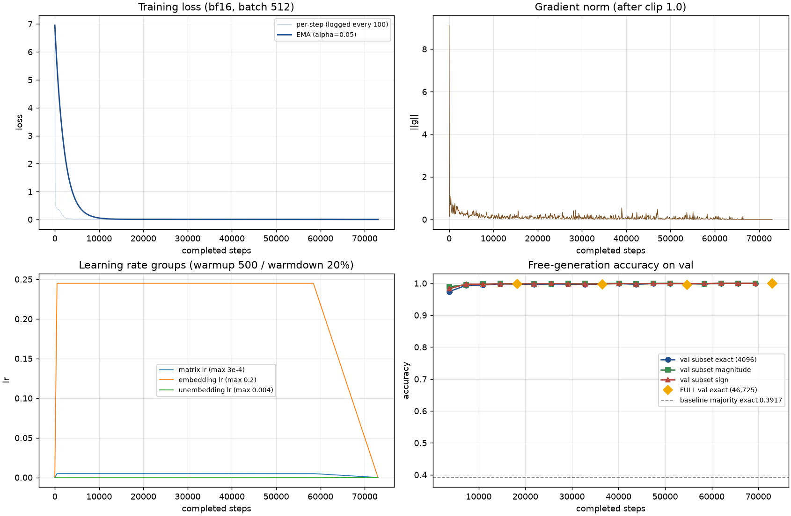

# Heptagon w6 MHV 训练与验收报告

> 训练日期: 2026-09-07 | run: `w6-random-seed42`（服务器 /root/autodl-tmp）
> 执行手册: [SERVER_RUNBOOK.md](../SERVER_RUNBOOK.md) | 设计: [HEPTAGON_W6_PLAN.md](../../amplitude_symbol/docs/HEPTAGON_W6_PLAN.md)
> 对照项目: [amplitude_symbol 报告目录](../../amplitude_symbol/reports/)（五圈振幅，96-99%）

## 一、实验目的

按 SERVER_RUNBOOK §1-§7 在服务器完成首次全流程：环境与数据交接、GPU smoke、
恢复对照、tiny overfit、compile smoke、正式训练、独立复评与 test 首评。
产出三圈 weight-6 MHV heptagon symbol 系数预测的基线数字，并验证整条流水线
（数据 → tokenizer → 训练 → checkpoint → 自由生成评估）无泄漏、可恢复、可复现。

## 二、训练配置

| 参数 | w6-random-seed42 |
|------|------------------|
| 架构 / 参数 | GPT 4 层 / 512 维 / 8 头 / 8 KV 头，**13,657,600** |
| Attention | word-bidirectional **[1,7)**（6 字母词内双向；旧默认 [1,11) 会覆盖答案位，已修复） |
| 序列 / 词表 | 16 tokens（8 prompt + 8 生成）；vocab 1048（42 字母 + 控制 + 1000 base-1000 块） |
| 监督 | 仅 sign@8、magnitude@9-10、EOS@11 三个位置（512×3/步） |
| 设备 batch / 名义总 batch | 512 / 8,192（真实输入 15/16 = 7,680 tokens/步） |
| Optimizer | AdamW fused，三组 LR：matrix 3e-4 / embedding 0.2 / unembedding 0.004；wd=0.01，clip=1.0 |
| 调度 | warmup 500 步 → 常数 → **warmdown 20%（58,406–73,008）** → 0 |
| Max steps | **73,008**（= 100.0003 train 轮） |
| Total tokens | 560.7M 输入（**41× params**；对照旧项目 180-600×）+ 112.1M 监督 |
| torch.compile / seed | true / 42 |
| 精度 / softcap | bf16 autocast / 15.0 |
| GPU / 显存峰值 | 1× RTX 5090 (32GB) / **0.88 GiB** |
| 训练时间 | **14.0 min** |
| 数据 | 373,800 train / 46,725 val / 46,725 test；**random-row split**（seed 42，非 orbit-grouped） |

## 三、训练 Loss 曲线



- **Phase 1（0–~5K）**：loss 6.9546 → 0.38（warmup 结束时）→ **0.0085 @ 5K**，magnitude 映射快速学习
- **Phase 2（~5K–58.4K）**：1e-3 量级缓慢下降，中段有探索性波动（20K 一度回升到 0.017）
- **退火期（58,406–73,008）**：**step 63,300 首次 loss<1e-6**（退火开始后 ~4.9K 步），
  结束时 loss=3.9e-10、grad_norm=1.8e-8

与旧 amplitude 报告的模式一致：**退火是 memorization 的触发条件**（旧项目退火开始后
~10-27K 步归零，本项目 ~4.9K 步，任务更小更快）。

## 四、吞吐与资源

| 指标 | 值 |
|------|----|
| 吞吐 | ~673K 输入 tok/s |
| MFU | ~26%（同旧报告口径估算：旧 545K tok/s = 21% MFU，同卡同规模） |
| Step 时间 | ~11.4 ms |
| 总训练时间 | 14.0 min（vs §6 实测预估 18-20 min） |
| Checkpoint | 21 个 × 79MB ≈ **1.7GB**（每 3,650 步 + best 更新 + 结束） |

## 五、评估结果

### 5.1 评估协议

- 每 3,650 步：固定 4,096 项 val 子集（seed 20260907）+ 256 项 train 诊断
- 每 18,250 步及结束：**全量 val 46,725 项**（此时不重复跑子集）
- **test 46,725 项仅评估一次**（`--allow-test` 显式解锁，训练与选模型全程未接触）
- 自由生成：贪心，只喂 8-token prompt（无标签），最多 8 个新 token，遇 EOS 停
- `best` 仅由全量 val exact 改善触发更新；常数基线（train 多数类 −1）exact=0.3917

### 5.2 子集 val 曲线（4,096 固定样本）

```
 Step    Exact%   Mag%   Sign%  Invalid%
 3650      97.4   98.9   98.3     0.0
 7300      99.4   99.6   99.7     0.0
10950      99.5   99.7   99.7     0.0
14600      99.8   99.9   99.8     0.0
21900      99.7   99.9   99.8     0.0
25550      99.8   99.8   99.9     0.0
29200      99.7   99.9   99.8     0.0
32850      99.7   99.9   99.8     0.0
40150      99.9   100.0  99.9     0.0
43800      99.7   99.8   99.8     0.0
47450      99.9   100.0  99.9     0.0
51100      99.9   100.0  100.0    0.0
58400      99.8   99.8   99.9     0.0
62050     100.0  100.0  100.0    0.0    ← 首次全对（退火期）
65700     100.0  100.0  100.0    0.0
69350     100.0  100.0  100.0    0.0
```

### 5.3 全量 val（46,725 项，每 18,250 步）

| Step | Exact% | Mag% | Sign% | Invalid |
|------|--------|------|-------|---------|
| 18,250 | 99.80 | 99.90 | 99.88 | 0 |
| 36,500 | 99.64 | 99.87 | 99.75 | **1 样本** |
| 54,750 | 99.56 | 99.82 | 99.72 | 0 |
| 73,000 | **100.00** | 100.00 | 100.00 | 0 | ← best 更新
| 73,008 | **100.00** | 100.00 | 100.00 | 0 | ← 最终

### 5.4 test 首评（46,725 项，唯一一次评估）

| 指标 | 值 |
|------|----|
| Exact | **100.00%（46,725/46,725）** |
| Magnitude | 100.00% |
| Sign | 100.00% |
| Invalid | 0 |
| 基线对照 | 多数类预测器 0.3917 → 模型 1.0000 |

逐项预测（行号/真值/预测，46,725 条）保存于 `best-test.json`。

### 5.5 独立复评一致性

对 best checkpoint `step_073000` 重新加载（数据/代码哈希校验通过）后独立评估全量 val：
exact=100.00%，与训练内记录一致。**checkpoint 可独立复现，评估无作弊。**

## 六、关键发现

### 6.1 val/test 双 100%，与旧项目 96-99% 的差异根因是任务与切分协议 🎯

旧 amplitude（五圈振幅，**orbit-grouped** 切分）全量 val 96.09-99.00%；本项目
（三圈 w6 MHV，**random-row** 切分）100%。两个项目模型同架构同规模、train loss 都归零。
差异来自两点，均非流水线缺陷：

1. **切分协议**：旧项目按对称性轨道分组，val/test 含训练未见的整个轨道 → 测泛化；
   本项目随机行切分，相关词跨 split → 测同分布插值（README/runbook 明确此口径）。
2. **任务规模**：五圈一般振幅 vs 三圈 w6 单一物理对象的完整展开
   （467,250 项全量覆盖，输出仅 33 种取值）。

泄漏防护正面证据：mask [1,7) 运行时校验并随 checkpoint 落盘、自由生成只喂 prompt、
test 全程隔离、独立重载复评一致。若存在泄漏，旧项目 [1,11) 口径早已到 100%。

### 6.2 任务学习极快 ⚡

子集 val 在 3,650 步（5 轮）已达 97.4%，18,250 步（25 轮）全量 val 99.8%。
预算结论：**14 分钟 / 41× params tokens 足以把同分布任务学到 100%**，
对照旧项目需要 150K-500K 步（180-600× params tokens）才到 96-99%。

### 6.3 退火触发 memorization 完成，与旧报告模式一致

loss<1e-6 首现于退火开始后 ~4.9K 步（63,300），此后约 9.7K 步接近零梯度空转
（grad_norm 降至 1e-8 量级但未精确为 0，与本项目 bf16 + 小模型有关）。

### 6.4 全量 val 中段轻微回撤

36,500 / 54,750 两步全量 val 略低于 18,250（99.56-99.64% vs 99.80%），且 36,500
出现 1 个 invalid 生成。与旧报告"同 seed 小波动"性质一致；退火后清零。1 个 invalid
样本的原始行号可在 `val_full_036500.json` 中追查。

### 6.5 恢复链路位级可信

§4 恢复对照：分段 10+10 与连续 20 步的 loss/grad_norm/LR 逐位一致（diff=0.0），
27 个张量 13,657,600 参数位级相同，固定 prompt 输出全同。正式训练中途停机可无损恢复。

### 6.6 runbook §1-§7 全流程验收通过

| 阶段 | 验收 | 结果 |
|------|------|------|
| §1 环境与数据 | 环境版本、5 文件哈希、GPU bf16 | ✅ |
| §3 GPU smoke | 20 步、全有限、rows_consumed=160 | ✅ |
| §4 恢复对照 | 分段=连续，位级一致 | ✅ |
| §5 tiny overfit | 32 样本自由生成 exact=1.0（900 步达成） | ✅ |
| §5 compile smoke | 编译路径可运行（启动成本 ~22s） | ✅ |
| §6 正式训练 | 73,008 步 / 14.0 min / 0.88 GiB | ✅ |
| §7 独立复评 + test | val 复评一致；test 100% | ✅ |

## 七、产物位置

```
/root/autodl-tmp/runs/heptagon/
├── w6-random-seed42/                      ← 正式训练产物
│   ├── run.json / baseline.json / summary.json / history.jsonl
│   ├── evaluation_rows.npz                ← 固定评估行选择
│   ├── val_subset_*.json / val_full_*.json / train_diagnostic_*.json
│   └── checkpoints/step_*（21 个 × 79MB）
├── smoke-eager/ resume-part1/ resume-part2/   ← §3 §4 产物
├── tiny-overfit/ smoke-compile/ bench-*/      ← §5 §6 实测产物
└── reports/
    ├── best-val.json                      ← §7 独立复评（exact=1.0）
    ├── best-test.json                     ← test 首评 + 46,725 条逐项预测
    └── w6-random-seed42/report.md         ← 简明报告（含曲线）
```

## 八、代码变更清单

| 文件 | 变更 |
|------|------|
| `projects/heptagon_symbol/train.py` | 修复 `validate_config` 对 Hydra 注入 `hydra` 键的误报（豁免 `hydra`，其余键保持严格校验） |

训练与评估脚本零改动；全部运行使用仓库内现有入口。

## 九、遗留问题

1. **orbit-grouped 对照实验**：当前 100% 是 random-row 同分布口径。若要得到与旧项目
   （96-99%）同口径的"轨道级泛化"数字，需对 w6 数据按对称性轨道重切分并重训
   （转换器目前明确不做轨道分组，需先改转换代码）。
2. **跨 weight 泛化**：w6 单点结论不能外推到 w2/w4/w8（runbook §8 已声明不含跨圈/跨权）。
3. **多 seed 方差**：当前仅 seed 42 单 run；旧项目同 seed 不同 run 有 ±1-2pp 波动。
4. **错误集分析不可行**：val/test 零错误，无可分析错误模式；中段 1 个 invalid 样本
   值得单独追查（`val_full_036500.json`）。
5. **早停信号**：loss<1e-6 后空转 ~9.7K 步（~2 分钟）；若加"loss 饱和即停"，
   预算可压缩到 ~63.5K 步。
6. **文档状态**：README.md / SERVER_RUNBOOK.md 中"待服务器验证"的描述已过时，
   需在本地侧更新后评审提交。
